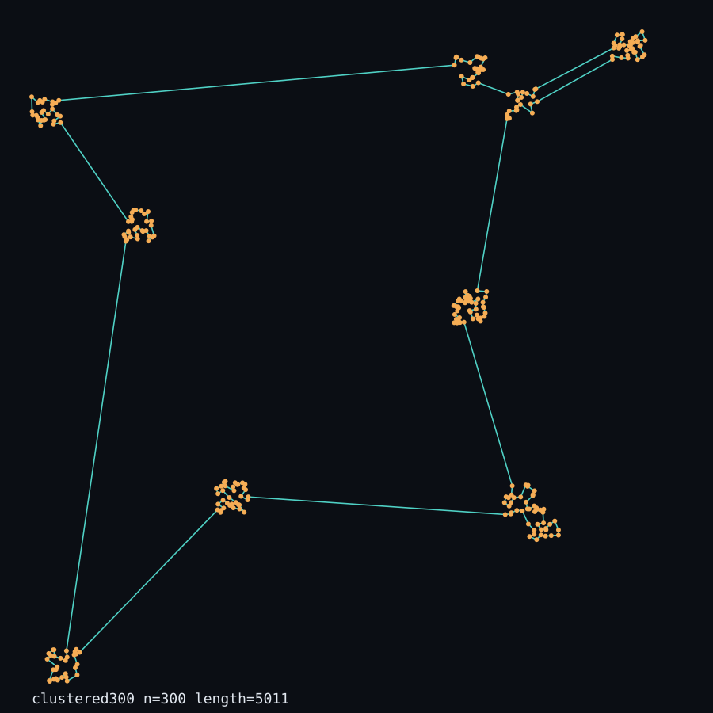
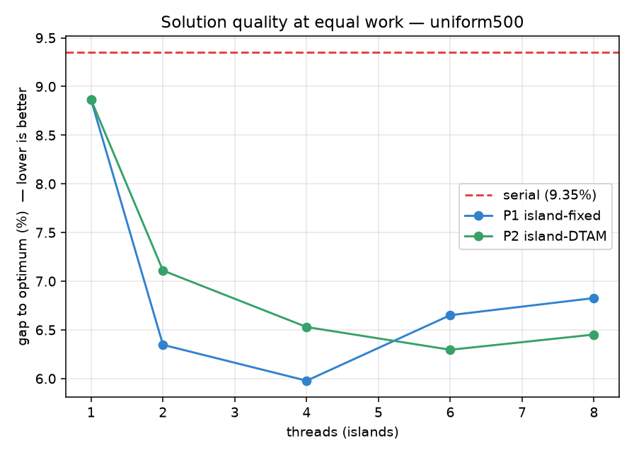

# ParallelRoute — Results & Statistics (presentation pack)

A figure-by-figure walkthrough of how the **three approaches** compare. Every plot below is
regenerated by `bench/plot_results.py`; the numbers are printed by `bench/analyze.py`.

**The three approaches**
| | Name | What it is |
|---|---|---|
| **Serial** | single-population GA | one panmictic population on **one** core (baseline) |
| **P1** | island-fixed | *T* islands (one per thread), **fixed** periodic ring migration (textbook parallel GA) |
| **P2** | island-DTAM | *T* islands, **Diversity-Triggered Distant-source** migration (our method) |

**What each plot proves**
1. Correctness → the GA/engine is right. 2. Speedup & 3. Efficiency → the parallel *time* benefit.
4. Quality at equal work & 5. Quality vs time → the parallel *solution* benefit. 6. Diversity →
population dynamics. 7. Policy across landscapes → when parallelism helps most, and that P1≈P2.

> **Experimental setup.** Platform: Apple M3, 8 cores (4 performance + 4 efficiency), macOS.
> Instance for the scaling study: `uniform-500` (500 random cities). Total population P = 240
> (split across islands), generations G = 400 (equal-work), epoch length E = 10, migrants K = 4,
> τ = 0.15, 2-opt on unless noted. **R = 8 seeds**, means reported. Two protocols: **equal work**
> (same population × generations → isolates *speed*) and **equal wall-clock** (fixed seconds →
> isolates *quality*). *(Re-run on the i5 to refresh these — see `HOW-TO-RUN-ON-i5.md`.)*

---

## The whole story in one table

| Metric | Serial | P1 (fixed) | P2 (DTAM) |
|---|---|---|---|
| Speedup @ 8 threads (equal work) | 1.0× | **2.52×** | 2.30× |
| Best efficiency (@ 2 threads) | — | 0.90 | 0.87 |
| Gap to optimum @ equal wall-clock (3 s) | 9.94% | **6.03%** | 6.11% |
| Gap @ equal work, best thread count | 9.35% | 5.98% (T=4) | 6.30% (T=6) |
| Tour length vs serial, no local search | 1.00× | **0.33–0.39×** | 0.34–0.40× |
| Correctness (circle, known optimum) | 0.00% gap | 0.00% gap | 0.00% gap |

**One-line summary:** parallel islands cut wall-clock time ~2.5× and, at equal wall-clock, reach
markedly shorter tours than serial; **P1 and P2 are statistically indistinguishable (within ~1% of
tour length) everywhere** — migration policy is a second-order factor here.

---

## 1. Correctness — the optimizer works

On the `circle` instance the optimal tour length is known in closed form, and all three engines
reach it exactly (**gap = 0.00%**), validating the GA operators, the distance metric, and the
parallel bookkeeping. Below is a real optimized route on a clustered 300-city instance (the
"product" view): the tour enters each cluster, optimizes locally, and links clusters efficiently.

---

## 2. Speedup vs threads (equal work)

Speedup = (serial wall-clock) ÷ (parallel wall-clock) at identical total work (serial baseline
≈ 4.44 s). Both parallel engines scale similarly and peak around **2.3–2.5×**.

| threads | P1 speedup | P2 speedup |
|--------:|-----------:|-----------:|
| 2 | 1.80× | 1.75× |
| 4 | 2.17× | 2.14× |
| 6 | 2.29× | 2.43× |
| 8 | 2.52× | 2.30× |

**Takeaway:** clear speedup, but sublinear — the curve sits below the dashed ideal. On this M3 that
is expected (see efficiency, next). P1 and P2 scale essentially identically.

---

## 3. Parallel efficiency (speedup ÷ threads)

| threads | P1 efficiency | P2 efficiency |
|--------:|--------------:|--------------:|
| 2 | 0.90 | 0.87 |
| 4 | 0.54 | 0.53 |
| 6 | 0.38 | 0.40 |
| 8 | 0.31 | 0.29 |

**Takeaway:** efficiency is **~90% at 2 threads** and falls to ~30% at 8. The drop is a hardware
story: the M3 has **4 performance + 4 efficiency cores**, so past ~4 threads we recruit slower
efficiency cores that lag at every barrier, and single-thread turbo makes the 1-core baseline
faster. **On the homogeneous i5, efficiency should hold up better through the physical core count.**
This is the Amdahl's-law / hardware discussion slide.

---

## 4. Solution quality at equal work

Given the *same amount of computation*, how good is the tour? (Lower gap = better.) The dashed red
line is the serial baseline (**9.35%**); both island engines sit well below it.

| threads | P1 gap | P2 gap |
|--------:|-------:|-------:|
| 2 | 6.35% | 7.11% |
| 4 | **5.98%** | 6.53% |
| 6 | 6.65% | **6.30%** |
| 8 | 6.83% | 6.45% |

**Takeaway:** the island *structure* itself improves quality (both ≈6–7% vs serial 9.35%) — dividing
the population into islands is beneficial beyond just speed. P1 and P2 trade the lead seed-to-seed
and stay within ~1% of each other in tour length.

---

## 5. Solution quality vs wall-clock time (equal budget)

Same 3-second budget for everyone; the curve is best-tour gap over time (mean of 8 seeds).

| approach | final gap @ 3 s | best seed | worst seed |
|---|---:|---:|---:|
| Serial | 9.94% | 6.51% | 12.81% |
| P1 (fixed) | **6.03%** | 2.74% | 7.27% |
| P2 (DTAM) | 6.11% | 4.03% | 8.36% |

**Takeaway:** in the same wall-clock the parallel engines convert their extra throughput into
**~4 percentage points less gap** than serial. P1 and P2 track each other throughout — the two lines
essentially overlap.

---

## 6. Population diversity over time

Diversity = mean edge-distance of a population to its own best tour (higher = more varied).

**Takeaway:** all engines lose diversity as they converge. The serial curve stays higher only
because it measures a single large population (240) over far fewer generations, whereas each island
(30 individuals) converges quickly. Crucially, **P1 and P2 overlap** — DTAM's diversity-triggered
pulls do **not** durably keep it more diverse than fixed migration on this landscape, which is the
mechanism behind the P1≈P2 result. *(Note: island vs serial diversity is not a like-for-like
comparison due to the different population sizes.)*

---

## 7. Migration policy across landscapes (the "why P1≈P2" evidence)

Bars = mean tour length ÷ serial (lower = better), for three landscape / local-search settings,
8 seeds each.

| landscape | serial | P1 | P2 | parallel vs serial | P2 vs P1 |
|---|---:|---:|---:|---:|---:|
| uniform-500, **no** 2-opt | 57120 | 18608 | 18969 | **−67.4%** | +1.9% |
| clustered-600, **no** 2-opt | 14395 | 5662 | 5755 | **−60.7%** | +1.7% |
| clustered-800, **with** 2-opt | 5825 | 5743 | 5746 | −1.4% | +0.1% |

**Takeaway (two points):**
- **The parallel win depends on local search.** *Without* 2-opt, islands find **60–67% shorter
  tours** in the same wall-clock (serial completes far fewer generations and has no repair). *With*
  2-opt, serial stays competitive per generation, so the gap shrinks to ~1.4%.
- **P2 ≈ P1 in every case** (within ~2%). With strong local search and the diversity the island
  structure already provides, the migration *policy* is second-order. We report this as measured;
  DTAM's practical upside is being self-tuning (no migration schedule to hand-pick).

---

## 8. Consolidated statistics (copy-ready)

Equal-work scaling on `uniform-500`, R = 8, serial baseline 4.44 s / 9.35% gap:

| T | P1 speedup | P1 eff | P1 gap | P2 speedup | P2 eff | P2 gap |
|--:|--:|--:|--:|--:|--:|--:|
| 2 | 1.80× | 0.90 | 6.35% | 1.75× | 0.87 | 7.11% |
| 4 | 2.17× | 0.54 | 5.98% | 2.14× | 0.53 | 6.53% |
| 6 | 2.29× | 0.38 | 6.65% | 2.43× | 0.40 | 6.30% |
| 8 | 2.52× | 0.31 | 6.83% | 2.30× | 0.29 | 6.45% |

Regenerate anytime with `python bench/analyze.py`.

---

## How to present this (suggested flow)

1. **Problem & approaches** (30 s) — TSP route optimization; serial vs P1 vs P2; define DTAM.
2. **Correctness** (§1) — "the engine is right: it hits the known optimum exactly."
3. **Speed** (§2–3) — "parallel gives ~2.5×; efficiency falls past 4 cores because of the M3's
   core layout — Amdahl's law in action."
4. **Quality** (§4–5) — "parallel isn't just faster; at equal time it finds much better tours than
   serial (~6% vs ~10% gap)."
5. **Policy study** (§7) — "we tested our DTAM idea vs standard migration across landscapes: the big
   lever is *parallelism + local search*, not the migration policy — P1 and P2 tie within ~1%."
6. **Honest conclusion** — "DTAM matches the baseline and is self-tuning; the headline HPC result is
   the parallel speedup and quality-per-second gain. Full write-up in `report/report.md`."
