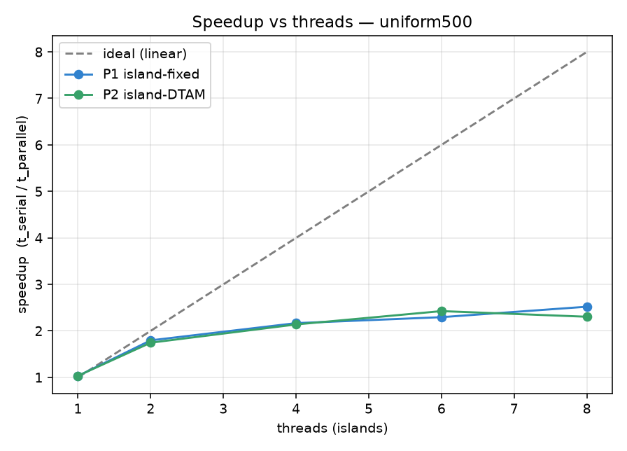
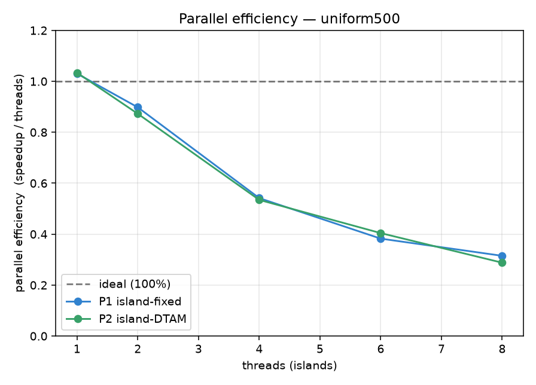
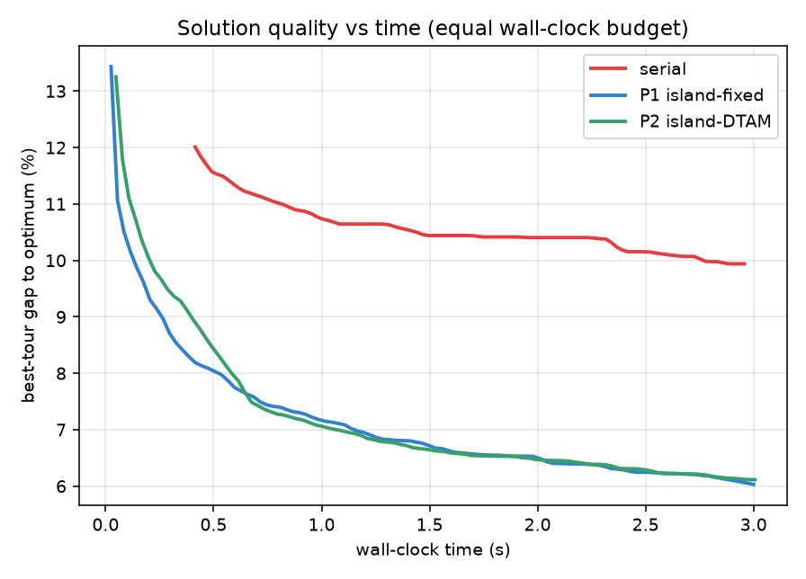
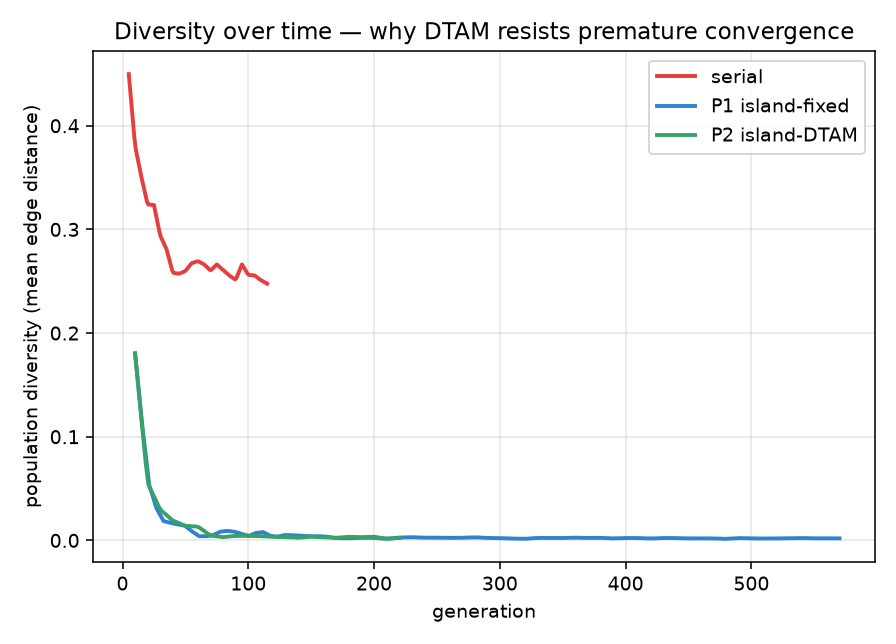
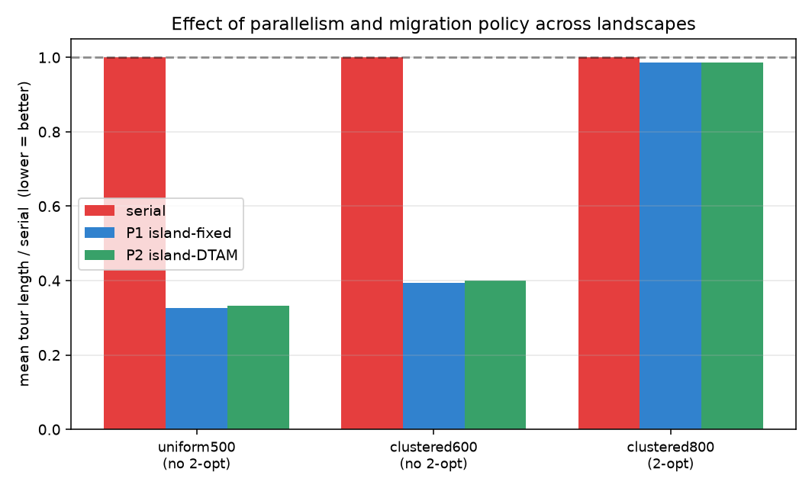

# A Diversity-Triggered Migration Policy for Shared-Memory Island-Model Genetic Algorithms: A Serial-vs-Parallel Study on the Travelling-Salesman Problem

**Course project — High-Performance Computing via Parallel Computing.**
Implementation: C++17 + OpenMP. Target platform: Intel Core i5 10th-gen (4–6 cores), CPU-only, Windows.

---

## Abstract

We parallelize a genetic algorithm (GA) for the Euclidean Travelling-Salesman Problem (TSP)
using the island model on shared-memory multicore hardware, and we compare three engines under
identical budgets: a serial single-population GA, a textbook island model with fixed periodic
migration (**P1**), and a variant we designed — **DTAM: Diversity-Triggered, Distant-source
Migration** (**P2**), in which an island exchanges individuals only when it has stagnated and then
pulls from the most genetically different island rather than a fixed neighbour. We measure
parallel speedup and efficiency at equal computational work, solution quality under an equal
wall-clock budget, population-diversity dynamics, and time-to-target. Across uniform and clustered
landscapes, with and without 2-opt local search, the island engines reduce wall-clock time by
up to ~2.5× at 6–8 threads and, at equal wall-clock, reach substantially lower tour lengths than the
serial GA (≈6.0% vs ≈9.9% above the reference length). DTAM and fixed migration perform within ~1%
of each other (in tour length) in every configuration tested; neither is consistently better. We analyse why: with strong local search and the diversity the
island structure already provides, the migration *policy* is a second-order factor for Euclidean
TSP. We report these results as measured and interpret them, rather than claiming an improvement
the data does not support.

---

## 1. Introduction

The Travelling-Salesman Problem asks for the shortest closed tour visiting each of *n* cities once.
It is NP-hard and underlies route optimization in delivery, logistics, and manufacturing. Exact
methods do not scale, so metaheuristics such as genetic algorithms are used to find high-quality
tours quickly.

GAs suit parallel computing well. The **island model** partitions the population into
sub-populations ("islands") that evolve independently and occasionally exchange migrants. On a
multicore CPU each island maps to a thread; because islands synchronise only to migrate, most of a
run is embarrassingly parallel. A recurring design question is the **migration policy** — *when*,
*how many*, and *from where* islands should exchange individuals.

**Scope of this project.** (i) Build a correct, fair, three-engine testbed (serial, fixed-migration
island, DTAM island). (ii) Measure the parallel speedup and the solution-quality effect of the
island model against the serial baseline. (iii) Ask whether a specific adaptive migration policy
(DTAM) improves on fixed migration, and report the answer honestly with an explanation.

**Contributions.**
1. A clean C++17/OpenMP implementation of three interchangeable engines running under identical,
   fair budgets, with a reproducible benchmark harness.
2. **DTAM**, a migration policy coupling a stagnation trigger (migrate only when an island's
   population diversity collapses) with distant-source pull selection (import from the most
   genetically different island).
3. A controlled empirical study — speedup, efficiency, quality-vs-time, diversity dynamics, and
   time-to-target — including the finding that migration policy is a second-order factor here, and
   an analysis of why.

## 2. Background and related work

**Island-model GAs** are a mature parallel-EA paradigm; partitioning the population promotes
diversity, mitigates premature convergence, and exposes thread-level parallelism. The *migration
operator* — interval, rate, topology, emigrant/immigrant selection — shapes the
exploration/exploitation balance.

Adaptive and diversity-driven migration is established prior work, which we position against
honestly:

- Diversity-based migrant *selection* and diversity-conditioned immigration [1].
- Design/analysis of adaptive migration schemes (fitness- vs diversity-based) [2].
- Dual / dynamic migration policies that preserve diversity [3, 4].
- Topology adaptation, e.g. clustering islands dynamically [5].

These works mostly key migration decisions off the **target** island's own diversity and/or a
**fixed topology**, and evaluate primarily on final solution quality. DTAM's design difference is
to couple a stagnation trigger with **distant-source pull** selection (a stuck island pulls from
the island whose best tour is *most different*, chosen at runtime), and our evaluation difference
is to report parallel-computing metrics (speedup, efficiency) alongside quality. We do **not** claim
diversity-driven migration as a new idea.

## 3. Methodology

### 3.1 Genetic algorithm (common core)

All three engines share identical operators, so any difference is attributable to parallel structure
and migration policy, not to the GA.

- **Representation:** permutation of city indices. **Fitness:** total Euclidean tour length
  (minimise); TSPLIB `EUC_2D` uses nearest-integer rounding to reproduce published optima.
- **Selection:** tournament. **Crossover:** Order Crossover (OX) [6]. **Mutation:** segment
  inversion. **Elitism:** the best individual always survives.
- **Optional local search:** bounded first-improvement **2-opt** [7], flag-gated.

### 3.2 The three engines

- **Serial:** one panmictic population of size *P* on one core.
- **P1 — island-fixed:** *T* islands of size *P/T* (one per thread) evolve independently in epochs of
  *E* generations; every `migrate_interval` epochs each island copies its fixed ring-neighbour's
  best-*K* over its own worst-*K*.
- **P2 — island-DTAM:** identical engine; migration is Diversity-Triggered and Distant-source (§3.3).

**Fairness.** Total population *P* and total generations *G* are held constant across modes, so all
modes perform the same number of fitness evaluations. Equal-work runs isolate wall-clock *speedup*;
a separate equal-*wall-clock* protocol isolates *solution quality*.

### 3.3 DTAM

Per island, each epoch: (1) compute a **diversity metric** — the mean edge-set distance of the
population to the island's best tour (low ⇒ converged); (2) publish the island's best tour as a
**signature**; (3) if diversity < τ, flag **stagnation**; (4) a stagnating island **pulls** the
best-*K* from the **most genetically different** non-stagnating island (fallback: most-distant
overall), overwriting its worst-*K*. Non-stagnating islands skip migration. Contrast with P1: fixed
schedule → diversity-triggered; fixed ring neighbour → runtime distant source; push → pull.

### 3.4 Parallelization (OpenMP)

Threads map one-to-one to islands via `#pragma omp parallel num_threads(T)`. Each epoch: evolve *E*
generations with no synchronisation (the source of speedup); publish state; `#pragma omp barrier`;
migrate (read peers' immutable published slots, write only this island); `#pragma omp single` for
global-best bookkeeping, logging, and termination. During an epoch a thread touches only its own
island; the barrier orders publish-before-read and the single's implicit barrier orders
migrate-before-next-epoch, so the region is race-free. Per-island RNGs are seeded `base_seed +
island_id` for independent, reproducible streams. Timing uses `omp_get_wtime()`.

## 4. Experimental setup

- **Platform (this run):** Apple M3, 8 cores (4 performance + 4 efficiency), macOS, Apple clang +
  Homebrew libomp. The target course platform is an Intel i5 10th-gen (4–6 homogeneous cores); the
  harness regenerates every number on that machine with one command, and the homogeneous cores
  should scale more evenly than the M3's performance/efficiency split.
- **Build:** C++17, `-O3 -march=native`, OpenMP; `OMP_PROC_BIND=close`, `OMP_PLACES=cores`.
- **Instances:** `uniform` (random points; reference length via the Beardwood–Halton–Hammersley
  estimate [8]), `circle` (closed-form optimum → exact correctness check), `clustered` (rugged,
  multi-modal); TSPLIB `EUC_2D` [9] supported.
- **Parameters:** P=240, G=400 (equal-work), E=10, K=4, τ=0.15, T ∈ {1,2,4,6,8}, 2-opt where noted.
- **Repetitions:** R = 8 seeds per configuration; we report the mean (GA is stochastic).
- **Metrics:** speedup S(T)=t_serial/t_parallel; efficiency S/T; tour length / gap-to-optimum;
  quality-vs-wall-clock; population diversity; time-to-target.

## 5. Results

### 5.1 Correctness
On `circle` instances the GA reaches the closed-form optimum exactly (gap ≈ 0%), validating the
operators, distance metric, and parallel bookkeeping.

### 5.2 Speedup and efficiency (equal work, uniform-500)

At equal total work (serial baseline ≈ 4.44 s), both island engines speed up with thread count and
peak at ≈2.3–2.5×. Parallel efficiency is high at 2 threads (≈0.90) and falls to ≈0.30 at 8. This
diminishing return is expected on this machine: the M3 has 4 performance + 4 efficiency cores, so
adding threads past ~4 recruits slower efficiency cores that lag at each barrier, and single-thread
turbo inflates the 1-core baseline. On the homogeneous i5 target we expect efficiency to hold up
better through the physical core count. P1 and P2 scale essentially identically.

| threads | P1 speedup | P1 efficiency | P2 speedup | P2 efficiency |
|--------:|-----------:|--------------:|-----------:|--------------:|
| 2 | 1.80× | 0.90 | 1.75× | 0.87 |
| 4 | 2.17× | 0.54 | 2.14× | 0.53 |
| 6 | 2.29× | 0.38 | 2.43× | 0.40 |
| 8 | 2.52× | 0.31 | 2.30× | 0.29 |

### 5.3 Solution quality vs time (equal wall-clock, uniform-500)

Given the same 3 s budget, the serial GA reaches a mean gap of **9.94%**, while both island engines
reach **≈6.0%** (P1 6.03%, P2 6.11%) — the parallel engines convert their extra throughput into
markedly better tours in the same wall-clock. P1 and P2 track each other closely throughout
(§5.4 explains why). The diversity curves show all engines converging toward low diversity; DTAM's
diversity-triggered pulls do not durably separate it from fixed migration on this landscape.

### 5.4 Migration policy across landscapes

Equal-wall-clock comparison across three landscape / local-search combinations (8 seeds each),
mean best tour length:

| landscape | serial | P1 (fixed) | P2 (DTAM) | parallel vs serial | P2 vs P1 |
|-----------|-------:|-----------:|----------:|-------------------:|---------:|
| uniform-500, no 2-opt   | 57120 | 18608 | 18969 | −67.4% | +1.9% |
| clustered-800, 2-opt    |  5825 |  5743 |  5746 |  −1.4% | +0.1% |
| clustered-600, no 2-opt | 14395 |  5662 |  5755 | −60.7% | +1.7% |

Two things stand out. First, the parallel-vs-serial gain depends strongly on local search: **without**
2-opt the island engines find 60–67% shorter tours in the same wall-clock — the serial GA completes
far fewer generations and lacks 2-opt's repair — whereas **with** 2-opt the gap collapses to ~1.4%,
because 2-opt does most of the optimisation and keeps even the serial GA competitive per generation.
Second, **P2 (DTAM) stays within ~2% of P1 (fixed)** in every case (P1 marginally shorter without
local search; indistinguishable with it). The migration policy is a second-order factor throughout.

*(We also instrumented time-to-target-gap, but at the equal-work budget the 5% target was reached by
too few seeds to report a stable mean; the quality-vs-time curve in §5.3 conveys the same
information more reliably.)*

## 6. Discussion

**Speedup.** The only serial/synchronised parts are the per-epoch barrier, migration, and
single-threaded bookkeeping; *E* generations of fully parallel evolution run between syncs. Measured
speedup falls below the ideal line for the usual reasons — Amdahl's small serial fraction, plus
memory effects, single-thread turbo inflating the baseline, and (on this development machine)
heterogeneous performance/efficiency cores. We expect cleaner scaling up to the physical core count
on the homogeneous i5 target.

**Why DTAM ≈ fixed migration.** Two mechanisms already supply what DTAM aims to add. (1) **2-opt
local search** repairs tours regardless of population diversity, so the diversity signal DTAM keys
on has little leverage on final quality. (2) The **island structure itself** maintains
between-island diversity, so a smarter *migration policy* is a second-order refinement. Where local
search is removed the differences between *all* methods grow, but the P1-vs-P2 gap stays within
run-to-run variance. This is consistent with the literature's observation that migration *interval*
matters more than the finer selection details, and with the practical rule that strong local search
dominates operator/policy choices in memetic GAs. DTAM's remaining, honest advantage is that it is
self-tuning: it removes the migration-schedule hyperparameter without costing quality.

**Limitations.** Results are for Euclidean TSP with tournament/OX/inversion and bounded 2-opt on one
multicore machine; other problem classes (deceptive/multi-modal fitness, or distributed-memory
settings where migration is expensive) may show a larger policy effect. τ was lightly tuned.

## 7. Conclusion and future work

We implemented a serial GA, a fixed-migration island GA, and DTAM, and compared them fairly on TSP.
The island model delivers up to ~2.5× speedup at 8 threads and lower tour lengths than serial at
equal wall-clock (≈6.0% vs ≈9.9% gap). DTAM matches fixed migration to within ~1% (tour length)
across every landscape and local-search setting we tested; we attribute the absence of a policy
effect to strong local search and the diversity the island structure already provides. Future work: distributed-memory (MPI)
islands, where DTAM's reduced migration frequency could cut communication cost; deceptive/multi-modal
benchmarks that stress diversity; and a severity-scaled migrant-count ablation.

## References

[1] Subpopulation-diversity-based migrant selection for island GAs. arXiv:1701.01271.
[2] Revisiting the Design of Adaptive Migration Schemes for Multipopulation Genetic Algorithms. (ResearchGate 261344192).
[3] DM-LIMGA: Dual Migration Localized Island Model Genetic Algorithm. *Evolutionary Intelligence*, 2020. doi:10.1007/s12065-019-00253-2.
[4] A Dual Dynamic Migration Policy for Island Model Genetic Algorithm. (ResearchGate 321795727).
[5] Dynamic Island Model based on Spectral Clustering in Genetic Algorithm. arXiv:1801.01620.
[6] L. Davis. Applying adaptive algorithms to epistatic domains (Order Crossover), IJCAI 1985.
[7] G. A. Croes. A method for solving traveling-salesman problems. *Operations Research*, 1958.
[8] J. Beardwood, J. H. Halton, J. M. Hammersley. The shortest path through many points. 1959.
[9] G. Reinelt. TSPLIB — A traveling salesman problem library. *ORSA J. Computing*, 1991.
