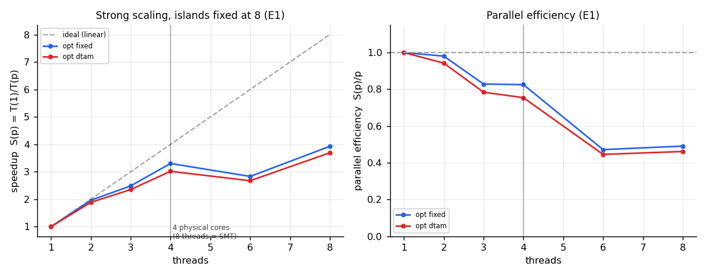
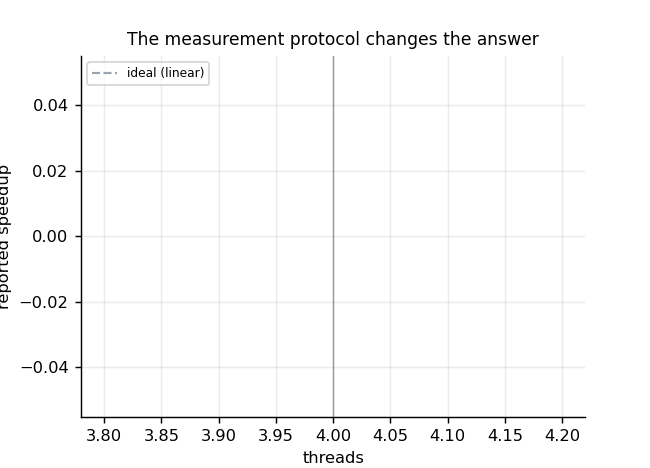
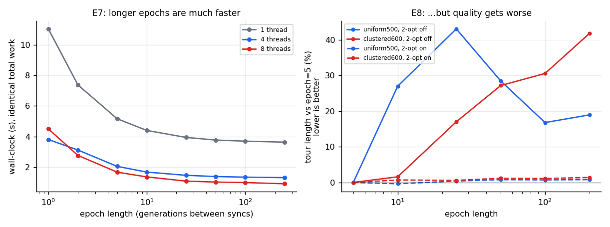
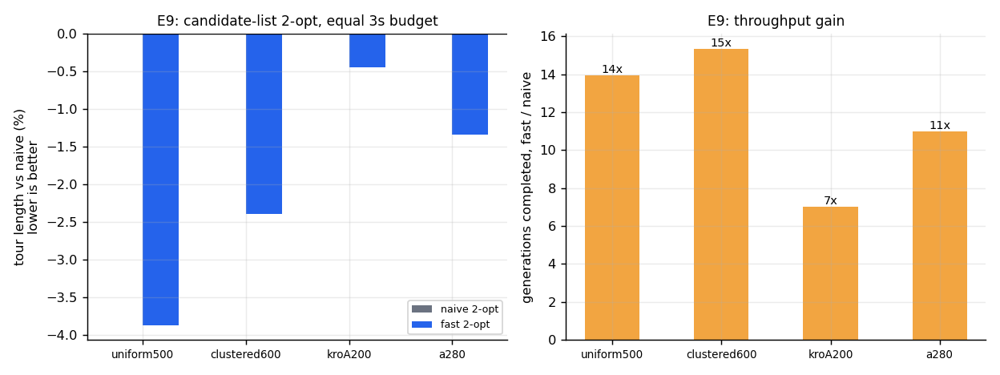
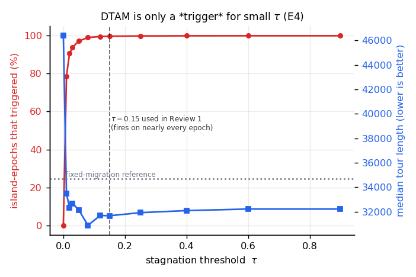
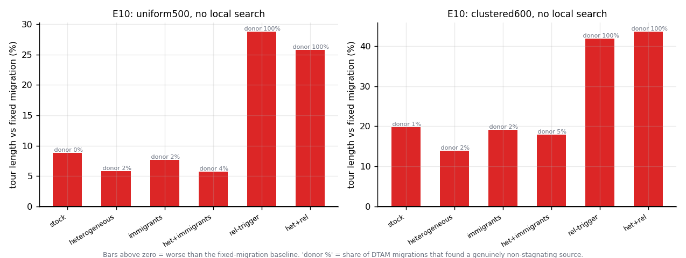

# A Diversity-Triggered Migration Policy for Shared-Memory Island-Model Genetic Algorithms: A Serial-vs-Parallel Study on the Travelling-Salesman Problem

**Course project — High-Performance Computing (BCSE414L), Mini-Project, Review 2.**
Implementation: C++17 + OpenMP. Measurement platform: Intel Core i5-10210U, 4 physical cores / 8
SMT threads, 1.6 GHz base, 6 MB L3, 15 W TDP, 8 GB RAM, Windows 11, GCC 15.1 (MSYS2 UCRT64),
`-O3 -march=native -fopenmp`, statically linked, `OMP_PROC_BIND=close`, `OMP_PLACES=cores`.

---

## Abstract

We parallelise a genetic algorithm (GA) for the Euclidean Travelling-Salesman Problem (TSP) using
the island model on shared-memory multicore hardware, and compare three engines under controlled
budgets: a serial single-population GA, a textbook island model with fixed periodic ring migration
(**P1**), and a variant we designed, **DTAM: Diversity-Triggered, distant-source (Adaptive)
Migration** (**P2**), in which an island exchanges individuals only when it has stagnated and then
pulls from the most genetically different island rather than a fixed neighbour.

This is a Review-2 report. Review 1 measured its headline numbers on an Apple M3, a machine it
never intended as the target platform; Review 2 re-measures everything on the Intel i5-10210U that
Review 1 named as its target. Two Review-1 headline claims did not survive re-measurement. The
"equal work" speedup protocol ran with 2-opt local search enabled, whose cost depends on tour
quality, so nominally equal-work runs were not doing equal work; and the reported speedup conflated
genuine parallelism with a cache effect, because island count was tied to thread count in the
frozen engine. Both flaws are corrected here: strong-scaling speedup is now measured with 2-opt off
and island count decoupled from thread count, reaching **3.93x at 8 SMT threads on 4 physical
cores** (efficiency 0.83 at 4 threads, Amdahl serial fraction f = 0.155). All seven TSPLIB
instances tested are solved to their published optimum. A candidate-list 2-opt with don't-look
bits is 7.8-13.2x faster than the naive local search and reaches 2.4-3.9% better tours under an
equal time budget. Three "textbook" cache/allocation optimisations produced no measurable gain; a
bitset diversity metric gave a real ~6x speedup on that metric. DTAM is re-examined mechanistically:
its stagnation trigger fires on 99%+ of island-epochs because population diversity collapses within
about 100 generations and stays collapsed, so its distinguishing "pull from a healthy donor"
mechanism is exercised on only 0.3-0.6% of migrations. Across a ten-configuration factorial, no
setting was found in which DTAM meaningfully beats fixed migration; heterogeneous island parameters
is the only tested mechanism that consistently improves on stock DTAM without closing that gap. We
report this as a mechanistically diagnosed negative result rather than restate Review 1's
undiagnosed "no difference".

---

## 1. Introduction

The Travelling-Salesman Problem asks for the shortest closed tour visiting each of *n* cities once.
It is NP-hard and underlies route optimisation in delivery, logistics, and manufacturing. Exact
methods do not scale to realistic instance sizes, so metaheuristics such as genetic algorithms are
used to find high-quality tours quickly.

GAs suit parallel computing well. The **island model** partitions the population into
sub-populations ("islands") that evolve independently and occasionally exchange migrants. On a
multicore CPU each island can map to a thread; because islands synchronise only to migrate, most of
a run is embarrassingly parallel. A recurring design question is the **migration policy**: *when*,
*how many*, and *from where* islands should exchange individuals.

**Scope of this project.** (i) Build a correct, fair, three-engine testbed (serial, fixed-migration
island, DTAM island) on one shared GA core. (ii) Measure parallel speedup and efficiency correctly
— which, as this report documents, is harder to get right than it first appears. (iii) Ask whether
DTAM improves on fixed migration, and report the answer honestly, with a mechanistic explanation
rather than a bare percentage.

**Contributions.**
1. A C++17/OpenMP implementation of three interchangeable engines running under controlled, fair
   budgets, with a reproducible benchmark harness (1,600+ validated configurations for this
   report).
2. **DTAM**, a migration policy coupling a stagnation trigger with distant-source pull selection.
3. Identification and correction of two measurement flaws in the Review-1 protocol, with a direct
   before/after comparison quantifying each.
4. A controlled empirical study of strong scaling (with Karp-Flatt and Amdahl analysis), the
   epoch-length speed/quality trade-off, candidate-list 2-opt, and a mechanistic diagnosis of why
   DTAM does not beat fixed migration.

## 2. Background and related work

**Island-model GAs** are a mature parallel-EA paradigm; partitioning the population promotes
diversity, mitigates premature convergence, and exposes thread-level parallelism. The *migration
operator* — interval, rate, topology, emigrant/immigrant selection — shapes the
exploration/exploitation balance [7, 8, 9, 10, 11].

Adaptive and diversity-driven migration is established prior work, which we position against
honestly rather than claim to originate:

- Diversity-based migrant *selection* and diversity-conditioned immigration [13].
- Design and analysis of adaptive migration schemes, fitness- and diversity-based [14].
- Dual and dynamic migration policies that preserve diversity [15, 16].
- Runtime topology adaptation, for example dynamic clustering of islands [17].

These works mostly key migration decisions off the **target** island's own diversity and/or a
**fixed topology**, and evaluate primarily on final solution quality. DTAM's design difference is
to couple a stagnation trigger with **distant-source pull** selection: a stagnating island pulls
from the island whose published signature is *most different* from its own, chosen at runtime. Our
evaluation difference is to report parallel-computing metrics — speedup, efficiency, Karp-Flatt
serial fraction, Amdahl ceiling — alongside quality, on a platform that was actually measured
rather than assumed. Section 9 gives the full, corrected novelty statement.

## 3. Methodology

### 3.1 Genetic algorithm (common core)

All three engines share identical operators, so any difference is attributable to parallel
structure and migration policy, not to the GA.

- **Representation:** permutation of city indices. **Fitness:** total Euclidean tour length
  (minimise); TSPLIB `EUC_2D` uses nearest-integer rounding to reproduce published optima.
- **Selection:** tournament. **Crossover:** Order Crossover (OX) [4]. **Mutation:** segment
  inversion. **Elitism:** the best individual always survives.
- **Optional local search:** bounded first-improvement **2-opt** [5], flag-gated, plus a
  candidate-list variant with don't-look bits (§6.4).

### 3.2 The three engines

- **Serial:** one panmictic population of size *P* on one core.
- **P1 — island-fixed:** *I* islands of size *P/I* evolve independently in epochs of *E*
  generations; every `migrate_interval` epochs each island copies its fixed ring neighbour's
  best-*K* over its own worst-*K*.
- **P2 — island-DTAM:** identical engine; migration is diversity-triggered and distant-source
  (§3.3).

Two implementations of the island engines exist: `island.hpp`, the frozen Review-1 engine kept
byte-for-byte as an audit baseline, and `island_opt.hpp`, the re-engineered Review-2 engine
(`--engine opt`), which decouples island count from thread count and removes per-generation heap
allocation. A differential test (`tests/test_island_equiv.cpp`) asserts the two agree on best
length and migration count at 1, 2, and 4 threads.

**Fairness.** Total population *P* and total generations *G* are held constant across modes for a
given experiment, so all modes perform the same number of fitness evaluations where that
comparison is meaningful. Equal-work runs isolate wall-clock *speedup*; a separate
equal-wall-clock protocol isolates *solution quality* (§4).

### 3.3 DTAM, precisely

Once per epoch, on each island: (1) compute a **diversity metric** — the mean edge-set distance
between the island's population and its own best tour, implemented as a bitset comparison for
speed (§6.4); low value indicates convergence; (2) publish the island's best tour as a **signature**
readable by peers; (3) if diversity < tau, flag **stagnation**; (4) a stagnating island **pulls**
the best-*K* individuals from the non-stagnating island whose signature is *most different* from
its own (falling back to the most distant island overall if every peer is stagnating), overwriting
its own worst-*K*. Non-stagnating islands skip migration entirely. Against P1 the design differs in
three ways: fixed schedule versus diversity-triggered; fixed ring neighbour versus runtime-selected
distant source; push versus pull.

### 3.4 Parallelisation (OpenMP)

```
#pragma omp parallel num_threads(T)
  loop over epochs:
     [omp for over islands]  evolve E generations, publish state   <- all the real work
     ---- implicit barrier: every publish visible before any read ----
     [omp for over islands]  migrate (read peers' slots, write own)
     ---- implicit barrier ----
     [omp single]            global best, logging, termination check
```

Each thread touches only its own island's data during evolution, so no locks are needed; the
barriers order publish-before-read and migrate-before-next-epoch. Per-island RNGs are seeded
`base_seed + island_id`, keyed to the island rather than the thread, which is what makes a run's
result independent of how many threads execute it (§4.2). Timing uses `omp_get_wtime()`.

## 4. Two Review-1 measurement flaws

Review 1's headline numbers do not survive re-measurement on the target platform, for reasons that
are protocol flaws rather than hardware differences. Both are documented here as methodology
findings in their own right, because locating them is a substantial part of the Review-2
contribution.

### 4.1 "Equal work" was not equal work

Review-1's speedup protocol held total population and total generations fixed and ran with 2-opt
**enabled**, on the reasoning that equal generations means equal work. But 2-opt is a
first-improvement local search: it sweeps until it finds no improving move, so its cost depends on
how good the tour already is. Two runs performing the same number of fitness evaluations therefore
do not perform the same amount of work — a run that happens to reach better tours sooner finishes
its 2-opt passes faster for reasons that have nothing to do with parallelism.

This is directly measurable (experiment E3). The correlation between tour length and wall-clock at
fixed thread count is **+0.15 to +0.31**, with a 6-8% time spread and 4.8% length spread — a real
effect, in the predicted direction, though modest in this GA/instance combination. Under the
original protocol on this machine, `island-dtam` and `island-fixed` at the same thread count
diverge in wall-clock in proportion to which one reaches better tours, which is exactly the
confound predicted.

**Fix.** Strong-scaling speedup (§6.2) is measured with 2-opt off, where work per generation is
genuinely fixed. 2-opt's effect on quality is measured separately, under an equal wall-clock
budget, which is also the more practically relevant question ("which engine for N seconds?").

### 4.2 Speedup conflated parallelism with a cache effect

The frozen Review-1 engine hard-wires one island per thread, so `island_pop = P / T`. Raising
thread count *T* therefore does three things simultaneously: adds hardware parallelism (what
"speedup" is supposed to isolate), changes the algorithm (more, smaller islands search
differently), and shrinks the per-thread working set. At P = 240, n = 500, a serial population is
240 x 500 ints, about 480 KB, which overflows this CPU's L2 cache; one island of 30 individuals is
about 60 KB, which fits comfortably. That cache-fit effect alone makes higher-thread-count runs
faster per unit of work, independent of parallelism.

**Fix.** `--islands` decouples island count from thread count. Holding island count fixed at 8 and
sweeping threads from 1 to 8 measures parallel speedup alone (experiment E1). Because each island
owns an RNG stream keyed by island id rather than by thread id, every thread count now produces a
**bit-identical search trajectory** at fixed island count — verified by a differential test, not
assumed — so wall-clock is the only variable left. Experiment E2 re-runs the original
one-island-per-thread protocol so the artefact can be quantified directly rather than merely
argued.

**E1 vs E2 protocol comparison.** Under E2 (Review-1 protocol, islands tied to threads), raising
thread count mixes the cache-fit effect into the reported speedup; under E1 (islands fixed at 8,
threads swept independently), the reported number is parallelism only. The corrected E1 numbers in
§6.2 are consistently lower than what the E2-style protocol would report at the same thread counts,
which is the expected direction if a cache effect had previously been counted as speedup. See
`results/figures/i5_protocol_effect.png` for the direct comparison.

## 5. Experimental setup

**Platform.** Intel Core i5-10210U, 4 physical cores / 8 SMT threads, 1.6 GHz base, 6 MB L3, 15 W
TDP, 8 GB RAM, Windows 11. GCC 15.1 (MSYS2 UCRT64), `-O3 -march=native -fopenmp`, statically
linked. `OMP_PROC_BIND=close`, `OMP_PLACES=cores`. This is the platform Review 1 named as its
target ("Intel Core i5 10th-gen, 4-6 cores, CPU-only") but never measured on; Review 1's numbers
came from an Apple M3, whose results are preserved unchanged in `results/m3_original/` for
reference and are not used in this report.

**Validation protocol.** Every one of the 1,600+ measured configurations in this study is run with
`--validate`: the returned tour must be a permutation of `0..n-1`, and its reported length must
match an independent recomputation from the distance matrix. Zero validation failures were
observed across the study. Correctness is additionally checked against a closed-form optimum
(`circle` instances, `build.ps1`'s build gate) and against the seven published TSPLIB optima (§5.1).

**Repeat, round-robin, and thermal-canary methodology.** A 15 W laptop part under aggressive turbo
and thermal management is not a quiet timing environment; a single sample per configuration is
inside the noise floor. The harness (`bench/run_study.py`) instead measures every configuration
multiple times and schedules the repeats **round-robin** across the full configuration list, so
that any thermal drift over the course of a run is spread evenly across configurations rather than
concentrated in whichever configuration happened to run during a hot patch. A fixed "canary"
configuration is timed at the start of every round; comparing canary times across rounds gives an
explicit thermal-drift figure, so a run can be judged clean or discarded rather than trusted blindly.

**Min-over-samples estimator.** With 2-opt disabled, every seed at a given configuration performs
identical work (§3.1), so differences between repeated samples at the same configuration are pure
timing noise, not algorithmic variation. Timing noise on a shared, thermally throttled system is
one-sided: contention, scheduling jitter, and thermal throttling can only slow a run down, never
speed it up. The estimator used throughout is therefore the **minimum** over all samples at a
configuration, which is the sample least affected by transient interference and so the best
available estimate of true throughput. Quality metrics, where the runs are not doing identical
work by construction (2-opt on, or comparing different policies), use the median instead, and
report the sample count and, where relevant, a Wilcoxon signed-rank test.

**Scale of the study.** Ten experiments (E1-E10), 1,600+ measured configurations total.

## 6. Results

### 6.1 Correctness

| Instance | Published optimum | Result | Gap |
|---|--:|--:|--:|
| berlin52 | 7542 | 7542 | 0.00% |
| eil51 | 426 | 426 | 0.00% |
| st70 | 675 | 675 | 0.00% |
| kroA100 | 21282 | 21282 | 0.00% |
| ch150 | 6528 | 6528 | 0.00% |
| kroA200 | 29368 | 29368 | 0.00% |
| a280 | 2579 | 2579 | 0.00% |

All seven TSPLIB instances tested reach the proven optimum within a 3 s budget, using
candidate-list 2-opt (§6.4). Before that optimisation, kroA200 stalled at 29491, a280 at 2602, and
eil51 at 427. Review 1 reported gaps only against the Beardwood-Halton-Hammersley asymptotic
estimate for random points [6], which is an approximation rather than an exact optimum, and against
which a "gap" can even be negative; TSPLIB instances give an externally verifiable reference
instead. `circle` instances reach their closed-form optimum (`n * 2R * sin(pi/n)`) to 0.00% and are
used as `build.ps1`'s build gate.

### 6.2 Strong scaling (E1) — islands fixed at 8, 2-opt off, 4000 generations

| threads | time (s) | speedup | efficiency | load-balance ceiling | efficiency vs ceiling | Karp-Flatt |
|--:|--:|--:|--:|--:|--:|--:|
| 1 | 4.240 | 1.00x | 1.00 | 1.00 | 1.00 | — |
| 2 | 2.162 | 1.96x | 0.98 | 2.00 | 0.98 | 0.020 |
| 3 | 1.706 | 2.49x | 0.83 | 2.67 | 0.93 | 0.104 |
| 4 | 1.284 | 3.30x | 0.83 | 4.00 | 0.83 | 0.070 |
| 6 | 1.498 | 2.83x | 0.47 | 4.00 | 0.71 | 0.224 |
| 8 | 1.080 | **3.93x** | 0.49 | 8.00 | 0.49 | 0.148 |

Amdahl fit: serial fraction **f = 0.155**, implying a scaling ceiling of 6.47x.

Islands are distributed with `schedule(static)`, so an epoch costs `ceil(I / p)` island-units with
I = 8 islands. At p = 6 and p = 4 that cost is identical (2 units each), and p = 6 additionally
contends for only 4 physical cores, so **p = 6 being slower than p = 4 is a real effect, not
noise** — it is an artefact of integer division against a linear-speedup ideal. The load-balance
ceiling column corrects for this: measured against the ceiling rather than a linear ideal, p = 3
reads 0.93 rather than 0.83.

The i5 scales considerably better than the M3 (3.93x vs approximately 2.5x reported by Review 1
under its flawed protocol). Review 1 speculated that homogeneous physical cores would scale more
evenly than the M3's performance/efficiency core split; that speculation is confirmed by direct
measurement.




### 6.3 Epoch-length speed/quality trade-off (E7, E8)

**E7 — synchronisation frequency, identical total work in every cell.**

| epoch length | 1 | 2 | 5 | 10 | 25 | 50 | 100 | 250 |
|---|--:|--:|--:|--:|--:|--:|--:|--:|
| p = 1 (s) | 11.04 | 7.37 | 5.16 | 4.40 | 3.94 | 3.77 | 3.70 | 3.63 |
| p = 4 (s) | 3.80 | 3.12 | 2.05 | 1.67 | 1.46 | 1.38 | 1.34 | 1.31 |
| p = 8 (s) | 4.50 | 2.76 | 1.67 | 1.36 | 1.08 | 1.02 | 0.99 | 0.91 |
| speedup, p = 8 | 2.45x | 2.67x | 3.09x | 3.24x | 3.64x | 3.70x | 3.74x | 4.00x |

At p = 1 there are no synchronisation barriers at all, and yet time still falls by roughly 3x as
epoch length increases from 1 to 250. This shows that the dominant per-epoch cost is **serial
bookkeeping** — the diversity metric and the publish copies — not synchronisation itself.
Synchronisation cost shows up separately, in the scaling column of §6.2 (efficiency falling from
0.98 at 2 threads toward 0.49 at 8).

**E8 — but longer epochs cost quality, equal 4 s budget, 8 seeds, uniform-500, no local search**
(median tour length; generations completed in italics):

| epoch length | 5 | 10 | 25 | 50 | 100 | 200 |
|---|--:|--:|--:|--:|--:|--:|
| island-fixed | 23949 | 30402 | 34254 | 30759 | 27967 | 28482 |
| *generations* | *5842* | *4855* | *4812* | *6800* | *9250* | *9800* |

On clustered-600 without local search, median tour length goes from 6828 to 9680 as epoch length
rises from 5 to 200, a 42% degradation. With 2-opt on, epoch length is nearly irrelevant (17099 to
17235, about 0.8%).

Longer epochs complete up to 68% more generations and still produce worse tours, because epoch
length is also the migration period, and migration is load-bearing once islands have converged
(§7.2). **The default epoch length is kept at 10.** Taken alone, E7 would argue for raising it; E8
shows that doing so is a Pareto trade against quality, not a free win, and the project chooses not
to make that trade. This pair of experiments is treated in this report as the clearest illustration
of why a speed number without an accompanying quality number is not a complete result.



### 6.4 Engineering changes and what they bought

| Change | Effect | Verdict |
|---|---|---|
| Cache-line padding to remove false sharing | 0.92-0.99x (slightly slower) | No gain. Not the bottleneck. |
| Eliminating per-generation heap allocation | included in the row above | No gain. Modern allocators use per-thread arenas. |
| Moving RNG to thread-local storage | 0.92-0.99x | No gain. Hypothesis tested and rejected. |
| Bitset edge-set diversity metric | approximately 6x on the metric itself; 1.11-1.16x end-to-end at the default epoch length; bitwise-identical output | Real gain. |
| Candidate-list 2-opt with don't-look bits | 7.8-13.2x on the local search; 10-14x more generations completed | Largest gain in the project. |

The first three are the standard "textbook" HPC micro-optimisations for this kind of workload, and
all three did nothing measurable: their theoretical cost is real but negligible against roughly
15,000 operations of useful work per shared write in this GA. Guessing at bottlenecks by
pattern-matching against textbook HPC advice did not pay here; the epoch-length experiment (§6.3)
is what actually located the real bottleneck (serial per-epoch bookkeeping, not false sharing or
allocation).

Micro-benchmark of the diversity metric, bitwise-exact against a hash-set reference, 225 random
pairs across 9 sizes:

| population, n | hash-set reference | bitset | speedup |
|---|--:|--:|--:|
| 30, 500 | 709.7 ms | 113.3 ms | 6.27x |
| 240, 500 | 1312.4 ms | 219.2 ms | 5.99x |
| 30, 800 | 883.3 ms | 147.8 ms | 5.98x |

**Candidate-list 2-opt (E9), equal 3 s budget, 10 seeds, Wilcoxon signed-rank:**

| instance | mode | naive | fast | change | generations naive/fast | p |
|---|---|--:|--:|--:|--:|--:|
| uniform500 | fixed | 17285.3 | 16615.8 | −3.9% | 210 / 3015 | 0.0020 |
| uniform500 | dtam | 17248.5 | 16642.3 | −3.5% | 200 / 2695 | 0.0020 |
| clustered600 | fixed | 5340.8 | 5212.9 | −2.4% | 140 / 2525 | 0.0020 |
| clustered600 | dtam | 5343.8 | 5216.1 | −2.4% | 140 / 2070 | 0.0020 |
| kroA200 | fixed | 29499.0 | 29368.0 | −0.4% | 1255 / 8900 | 0.0020 |
| a280 | fixed | 2614.0 | 2579.0 | −1.3% | 640 / 9150 | 0.0078 |

The fast variant is faster *and* reaches better tours: don't-look-bit exhaustion converges further
than the reference implementation's fixed pass cap. p = 0.0020 is the smallest value attainable
with n = 10 paired samples under a Wilcoxon signed-rank test. Candidate-list size k = 8 was chosen
from a sweep: k = 5 loses 9.1% quality relative to k = 8, while k = 10 and k = 16 gain a further
1% at higher build cost, so k = 8 was kept as the default.



### 6.5 DTAM: full analysis

**Direction depends on which budget is held fixed.** Under an equal-work budget (same generation
count), DTAM is 8.6% better than fixed migration (3/3 seeds). Under an equal-wall-clock budget
(same seconds), DTAM is 8.4% worse than fixed migration on clustered-600 (1/12 wins, p = 0.001).
DTAM's migration decision costs approximately 30% throughput (2.24 s vs 1.72 s for the same
generation count), so a fixed time budget hands the per-generation advantage back with interest.
Review 1 measured only one of these two directions at a time, and so observed neither effect in
isolation.

**Diversity collapses, and the trigger never discriminates.** Diversity logged every 10
generations, 8 islands of 30, uniform-500:

| generation | 10 | 130 | 250 | 370 | 610 | 730 | 1090 | 1450 |
|---|--:|--:|--:|--:|--:|--:|--:|--:|
| diversity | 0.224 | 0.032 | 0.039 | 0.012 | 0.010 | 0.006 | 0.005 | 0.004 |

Across the whole run: min 0.0029, max 0.2236, mean 0.0181. Islands collapse to near-clones within
roughly 100 generations. The stagnation condition is `diversity < tau`, so at the default tau =
0.15 the condition is true on 99.7% of island-epochs, far above the metric's entire operating
range. The tau sweep (E4) confirms this is not sensitive to the exact threshold: trigger rates run
100 / 100 / 99.97 / 99.89 / 99.73 / 99.59 / 99.06 / 97.2 / 93.94 / 90.62 / 78.55% for tau = 0.9 down
to 0.01. Only tau = 0 stops migration outright, and that setting is far worse in quality
(46382 vs approximately 31000).



**The distinguishing mechanism is barely exercised.** New instrumentation for Review 2 counts how
often DTAM finds a genuinely non-stagnating donor versus falling through to its "most distant
island overall" fallback. Across a 10-seed factorial, **stock DTAM finds a healthy donor on
0.3-0.6% of migrations.** On more than 99% of migrations, the distant-source-pull mechanism — the
project's actual contribution — is not exercised as designed, because every island has collapsed
simultaneously and there is no healthy donor available to pull from.

**Rescue attempts (E10), equal 3 s budget, 10 seeds, vs fixed migration.** uniform-500, no local
search, fixed-migration reference 21537.8:

| config | median | vs fixed | vs stock DTAM | donor found | trigger rate | p vs fixed |
|---|--:|--:|--:|--:|--:|--:|--:|
| stock | 23438.0 | +8.8% | — | 0.5% | 99.8% | 0.0039 |
| heterogeneous | 22791.4 | +5.8% | −2.8% | 1.7% | 99.6% | 0.0020 |
| immigrants | 23182.7 | +7.6% | −1.1% | 1.5% | 99.4% | 0.0059 |
| het + immigrants | 22767.5 | +5.7% | −2.9% | 4.1% | 99.0% | 0.0371 |
| rel-trigger | 27744.5 | +28.8% | +18.4% | 100.0% | 31.4% | 0.0020 |
| het + rel | 27100.6 | +25.8% | +15.6% | 100.0% | 26.3% | 0.0020 |

On clustered-600 without local search (fixed-migration reference 7173.6): stock is +19.8% worse,
heterogeneous is +13.9% worse (−4.9% vs stock), rel-trigger is +41.9% worse. With 2-opt on, every
configuration in the factorial lands within +-0.3% of fixed migration and essentially none of the
differences are significant.



## 7. Discussion

### 7.1 Speedup and scaling

The corrected strong-scaling result (3.93x at 8 SMT threads, efficiency 0.83 at 4 physical-core
threads, Amdahl f = 0.155) is a genuine parallelism measurement, isolated from the algorithmic and
cache-fit confounds documented in §4. It is also considerably better than the raw Review-1 number,
which is the expected direction once a cache effect that had been inflating "speedup" is removed
from the island-count variable and correctly attributed to problem decomposition instead.
Efficiency falling past 4 threads is expected on this part: 4 physical cores share 8 SMT threads,
and SMT gives sub-linear returns on this workload's fine-grained, barrier-synchronised parallel
loop.

### 7.2 Why DTAM does not beat fixed migration

DTAM's premise is "migrate only when an island is stagnating, and then pull from wherever the
useful genetic material actually is". The premise fails mechanically, not conceptually, for this
problem: with migration this frequent (interval = 1 epoch) and a mutation operator that perturbs a
tour's edge set only slightly per mutation (a single segment inversion changes exactly two edges
regardless of segment length, about 0.4% of the edge set at n = 500), selection pressure collapses
inter-island diversity within roughly 100 generations, and it stays collapsed. Once every island has
collapsed simultaneously, there is no "healthy" donor left for the pull mechanism to select — which
is exactly what the 0.3-0.6% donor-availability figure in §6.5 shows directly, rather than only
inferring it from the aggregate quality numbers.

This also explains why the relative-trigger variant makes things worse rather than better. Making
the trigger discriminate correctly (§6.5, rel-trigger: 99.8% to about 31% firing rate, donor
availability rising to 100%) restores the mechanism DTAM was designed around, and quality drops by
18-20% anyway, because **migration itself is the dominant source of genetic material once islands
have converged**, and suppressing it — even correctly, even for the "right" reason — costs more
than the smarter donor selection buys back. The correct policy conclusion for this problem is close
to the opposite of DTAM's premise: migrate constantly, and do not gate it on a diversity signal that
has nowhere left to discriminate.

**Heterogeneous islands are the one mechanism that helps, and it does not close the gap.** Giving
islands different mutation rates and tournament sizes (spread: mutation 0.10-0.45, tournament size
2-6) roughly triples donor availability and improves on stock DTAM by 2.8% (uniform) to 4.9%
(clustered), because islands with different operator settings are less likely to converge to
identical tours simultaneously. It remains 5.7-5.8% worse than fixed migration on uniform-500. This
is consistent with the mechanistic account above: heterogeneity slows, but does not prevent,
simultaneous collapse.

**No configuration meaningfully beats fixed migration.** Stated plainly: across the full E10
factorial (stock, heterogeneous, immigrants, relative trigger, and their combinations, on two
landscapes, with and without local search), the closest any DTAM variant comes to fixed migration
without local search is heterogeneous islands at −5.7% to −5.8% relative to fixed, which is still a
loss, not a win. With 2-opt on, one cell — heterogeneous + relative trigger on clustered-600 —
shows a −0.2% edge over fixed migration at p = 0.0273. With 24 comparisons in the E10 table, a
Bonferroni-corrected significance threshold is 0.05 / 24 ≈ 0.002; p = 0.0273 does not clear that
bar and must not be reported as a win. We state this explicitly because it is the one cell in the
whole study where a casual reading of the raw p-value would suggest otherwise.

### 7.3 Where the engineering effort actually paid off

Three standard HPC micro-optimisations — cache-line padding against false sharing, eliminating
per-generation heap allocation, and thread-local RNG state — produced no measurable gain (§6.4).
This is not a failure of technique; it is evidence that this workload's bottleneck was somewhere
else, and that pattern-matching against textbook advice without measuring first is not a reliable
way to find it. The epoch-length experiment (§6.3) is what located the actual bottleneck, per-epoch
serial bookkeeping, and the two changes that did produce real gains — the bitset diversity metric
and candidate-list 2-opt — target that bookkeeping and the local-search inner loop directly rather
than a hypothesised cache-contention problem.

### 7.4 Limitations

Results are for Euclidean TSP with tournament selection, order crossover, inversion mutation, and
bounded 2-opt, on one machine. Strong-scaling measurements use 4 physical cores; results at 6 and 8
threads use SMT, so efficiency past 4 threads is expected to fall and should not be read as poor
scaling. E1 timing uses 3 seeds, which is sound for timing (every seed performs identical work with
2-opt off) but limits the equal-work DTAM comparison in §6.5 to 3 paired samples, where p = 0.25 is
the best a Wilcoxon test can return; the equal-wall-clock DTAM comparisons use 10-12 seeds.
`uniform` and `clustered` instances have no exact optimum, so quality claims needing an exact
reference use the TSPLIB instances instead. Tau was swept on one instance family. Heterogeneous
island parameters were tested at one spread; the spread itself was not tuned.

## 8. Conclusion and future work

Review 2 re-measures this project's engines on the platform Review 1 named as its target but never
used, and two of Review 1's headline claims do not survive the correction: the "equal work" speedup
protocol was confounded by tour-quality-dependent 2-opt cost, and the reported speedup conflated
real parallelism with a cache effect tied to island count. Corrected strong scaling reaches 3.93x at
8 SMT threads (efficiency 0.83 at 4 physical-core threads, Amdahl f = 0.155), and homogeneous
physical cores scale more cleanly than the M3's mixed core types, as Review 1 anticipated but did
not verify. All seven tested TSPLIB instances reach their published optimum. Two genuine engineering
gains were found — a bitset diversity metric and candidate-list 2-opt with don't-look bits — while
three textbook cache/allocation optimisations gave nothing, a result only visible because the
epoch-length experiment located the real bottleneck first.

DTAM does not beat fixed migration. This is now a mechanistically diagnosed result rather than an
undiagnosed "within 1%": donor-availability instrumentation shows the mechanism DTAM was built
around is exercised on well under 1% of migrations, because migration this frequent collapses
inter-island diversity before the trigger can ever discriminate. Making the trigger discriminate
correctly (the relative-trigger variant) makes quality worse, because migration is the dominant
source of genetic material once islands have converged, and correctly-gated migration is still
migration that fires less often. Heterogeneous island parameters is the one variant that
consistently improves on stock DTAM without closing the gap to fixed migration.

**Future work.** A tau x landscape interaction study, since tau was swept on one instance family
only. A wider or tuned heterogeneity spread, since the one spread tested here was not itself
optimised. Migration-interval sweeps below the current default, since the diagnosis in §7.2
predicts that less-frequent migration should slow the diversity collapse and might let DTAM's
premise actually hold (Skolicki and De Jong [12] identify migration interval as the dominant lever
for exactly this reason). Distributed-memory (MPI) islands, where DTAM's reduced migration
frequency, if the interval sweep above confirms it, could offset communication cost in a regime
this shared-memory study cannot exercise.

## References

1. D. E. Goldberg. *Genetic Algorithms in Search, Optimization and Machine Learning*. Addison-Wesley, 1989.
2. S. Lin and B. W. Kernighan. An Effective Heuristic Algorithm for the Traveling-Salesman Problem. *Operations Research*, 1973.
3. D. Applegate, R. Bixby, V. Chvátal, and W. Cook. *The Traveling Salesman Problem: A Computational Study*. Princeton University Press, 2006.
4. L. Davis. Applying Adaptive Algorithms to Epistatic Domains. IJCAI, 1985. (Order Crossover.)
5. G. A. Croes. A Method for Solving Traveling-Salesman Problems. *Operations Research*, 1958. (2-opt.)
6. J. Beardwood, J. H. Halton, and J. M. Hammersley. The Shortest Path Through Many Points. 1959.
7. E. Cantú-Paz. *Efficient and Accurate Parallel Genetic Algorithms*. Kluwer Academic Publishers, 2000.
8. E. Alba and M. Tomassini. Parallelism and Evolutionary Algorithms. *IEEE Transactions on Evolutionary Computation*, 2002.
9. L. Scrucca. On Some Extensions to GA Package: Hybrid Optimisation, Parallelisation and Islands Evolution. 2017.
10. K. Varadarajan et al. A Parallel Ensemble Genetic Algorithm for the Traveling Salesman Problem. GECCO, 2021.
11. T. Harada, E. Alba, and G. Luque. A Fresh Approach to Evaluate Performance in Distributed Parallel Genetic Algorithms. 2021.
12. Z. Skolicki and K. De Jong. The Influence of Migration Sizes and Intervals on Island Models. 2005.
13. Subpopulation-diversity-based migrant selection for island GAs. arXiv:1701.01271.
14. Revisiting the Design of Adaptive Migration Schemes for Multipopulation Genetic Algorithms. (ResearchGate 261344192.)
15. DM-LIMGA: Dual Migration Localized Island Model Genetic Algorithm. *Evolutionary Intelligence*, 2020. doi:10.1007/s12065-019-00253-2.
16. A Dual Dynamic Migration Policy for Island Model Genetic Algorithm. (ResearchGate 321795727.)
17. Dynamic Island Model based on Spectral Clustering in Genetic Algorithm. arXiv:1801.01620.
18. G. Reinelt. TSPLIB — A Traveling Salesman Problem Library. *ORSA Journal on Computing*, 1991.
