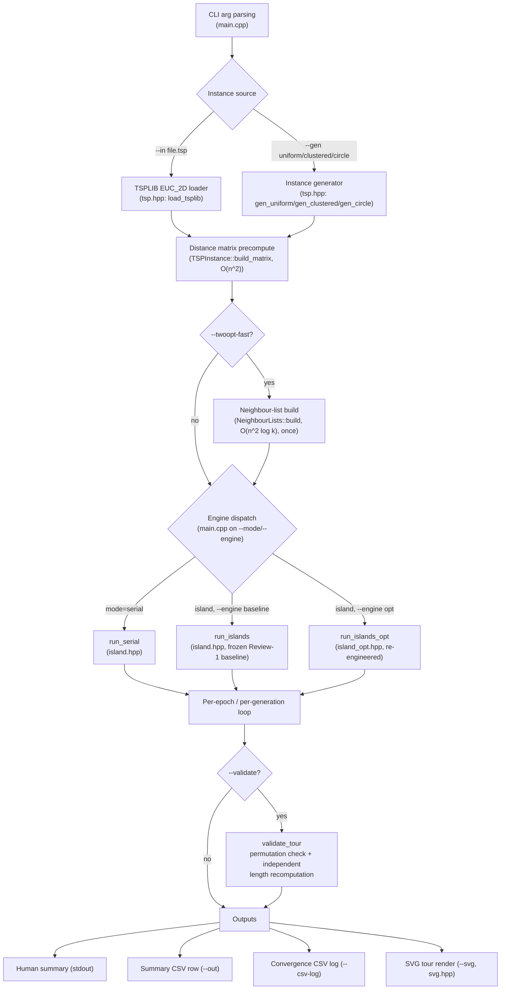
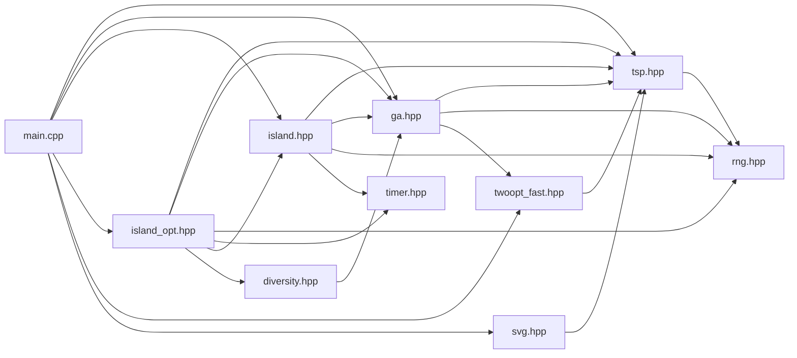
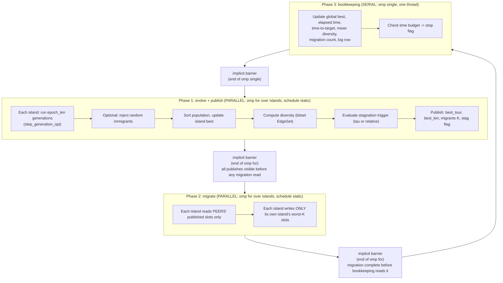
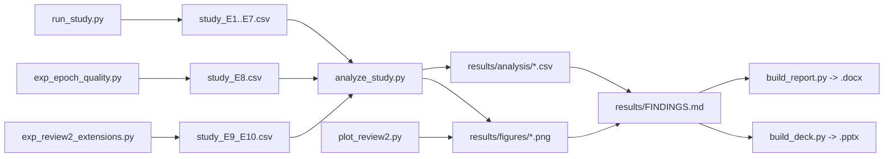

# Architecture and Data Flow

Viva preparation document. Source of all numbers: `results/FINDINGS.md`. Source of all component
descriptions: `PROJECT-GUIDE.md` and `src/*.hpp`, `src/main.cpp` (read directly for this document).
No number below is invented, re-rounded, or extrapolated beyond what those two files state.

---

## 1. Orientation

`ParallelRoute` is a C++17/OpenMP command-line program that solves the Euclidean Travelling
Salesman Problem with a genetic algorithm. It builds or loads a TSP instance (TSPLIB file, or a
generated `uniform` / `clustered` / `circle` point set), then optimises a population of candidate
tours using one of three engines: a serial panmictic GA, an island-model GA with fixed periodic
ring migration (`island-fixed`, P1), or an island-model GA with diversity-triggered distant-source
migration (`island-dtam`, P2, the project's own contribution). Optional candidate-list 2-opt local
search refines individual tours. The program produces: a human-readable summary on stdout, an
optional machine-readable summary CSV row (`--out`), an optional per-generation convergence log
(`--csv-log`), and an optional SVG rendering of the best tour found. Correctness is checked either
by `--validate` (permutation + independent length recomputation) or by comparison against a known
optimum.

---

## 2. High-level system diagram

---

## 3. Module dependency diagram

Derived by grepping every `#include` line in `src/*.hpp` and `src/main.cpp`.

Dependencies flow strictly one way, from primitive representation upward to engine and CLI:
`rng.hpp` (RNG primitive, depends on nothing project-internal) → `tsp.hpp` (instance representation,
depends only on `rng.hpp` for its generators) → `twoopt_fast.hpp` (depends only on `tsp.hpp`) →
`ga.hpp` (the shared GA core, depends on `tsp.hpp`, `rng.hpp`, and `twoopt_fast.hpp`) →
`diversity.hpp` (depends on `ga.hpp` for `Individual`/`Population`/`enc_edge`) → `island.hpp` (the
frozen baseline engine, depends on `tsp.hpp`, `ga.hpp`, `rng.hpp`, `timer.hpp`) → `island_opt.hpp`
(the re-engineered engine, depends on all of the above plus `island.hpp` itself, reusing its `Mode`,
`EngineParams`, `LogRow`, `Result`, `target_length`) → `main.cpp` (includes everything it dispatches
between). `timer.hpp` and `svg.hpp` are leaves consumed near the top of the chain. There is no cycle;
`island_opt.hpp`'s comment confirms this was checked deliberately ("twoopt_fast.hpp depends only on
tsp.hpp, so there is no include cycle").

**Why `ga.hpp` includes `twoopt_fast.hpp` directly instead of forward-declaring `two_opt_fast` and
`NeighbourLists`.** `ga.hpp`'s comment (lines 8-11) states the reason explicitly: a forward
declaration would leave an undefined symbol in any translation unit that enables fast 2-opt (via
`GAParams::use_fast_2opt`, which `step_generation_opt` branches on) but does not itself
`#include "twoopt_fast.hpp"`. `tests/test_equiv.cpp` hit exactly that failure mode. Because
`twoopt_fast.hpp`'s own dependency is only `tsp.hpp`, including it fully from `ga.hpp` costs nothing
in terms of new coupling and removes an entire class of link-time bug.

---

## 4. Per-epoch data flow (the parallel region)

This is the structure inside `run_islands_opt` (`island_opt.hpp`), the engine actually used for the
performance study. `run_islands` (`island.hpp`) is structurally identical except that islands are
hard-wired one-per-thread and the per-island state lives in parallel `std::vector`s instead of one
`IslandSlot` array (see §5, §7).

Marking clearly: Phase 1 and Phase 2 are the two parallel regions (each thread touches a disjoint
subset of islands, so no locks are required inside either). The barrier after Phase 1 is required
because Phase 2 reads every island's published `best_tour`/`migrants`/`stag` — without it a thread
could read a peer's stale (previous-epoch) publication or a half-written one. The barrier after
Phase 2 is required because Phase 3's global-best/logging pass reads every island's post-migration
state, and because the next epoch's Phase 1 must not start evolving island `i` while another thread
is still writing into `i`'s worst-K slots during migration. Phase 3 is single-threaded by
construction (`#pragma omp single`) since it aggregates global state and appends one log row.

One documented defect in the frozen baseline (`island.hpp`) is directly relevant here: its migration
phase is **not** a separate `omp for` with its own barrier — it is inline code between the publish
barrier and an `omp single`, and the comment claiming "implicit barrier guarantees migration is
done" is wrong, because `omp single`'s implicit barrier is at its *exit*, not its *entry* (§7.4 of
`PROJECT-GUIDE.md`). This makes the *logged* migration count in the baseline engine potentially read
mid-migration, though population data itself is still safe because the `omp single`'s exit barrier
orders migration before the next epoch. `island_opt.hpp` fixes this by making migration a true
`#pragma omp for` (a barrier is a required property of a correct fork-join phase transition here, not
an optional safety margin).

---

## 5. Data-structure walkthrough

n = 500 is used for footprint figures, matching the machine's working-set discussion in
`PROJECT-GUIDE.md` §6.2 (which computes 240 × 500 × 4 B ≈ 480 KB for a full population — the
comment describes ints there, and `Individual::tour` is `std::vector<int>`).

| Structure | Holds | Owner | Approx. footprint at n=500 | Thread-shared or private |
|---|---|---|---|---|
| `TSPInstance` | Coordinates (`xs`,`ys`), full `n*n` distance matrix (`dmat`, `double`), name, `known_opt`, `opt_is_exact`, `rounded` flag | Constructed once in `main.cpp`, read for the whole run | `dmat` alone is 500×500×8 B = 2,000,000 B ≈ 1.9 MB | Shared, read-only after construction (no engine mutates it) |
| `Individual` | One tour: `std::vector<int> tour` (permutation of city indices) + `double len` | Owned by whichever `Population` currently holds it | 500 × 4 B + 8 B ≈ 2.0 KB | Whichever context holds it — see `Population` below |
| `Population` | `std::vector<Individual>` — one island's (or the serial run's) working set | Serial: the single global population. Island engines: one per island, private to that island's thread(s) | At island_pop = 30 (see E1 default of 8 islands over pop=240): 30 × ~2.0 KB ≈ 60 KB. At serial pop=240: 240 × ~2.0 KB ≈ 480 KB | Thread-private in both island engines (each thread/task touches only its own island's `pop`); the serial engine's single population is inherently single-threaded |
| `GAParams` | Tunable GA knobs: `pop_size`, `tournament_k`, `mutation_rate`, `elites`, `use_2opt`, `two_opt_passes`, `two_opt_rate`, `use_fast_2opt`, non-owning `const NeighbourLists* nbr` | One master copy in `EngineParams::ga`; `island_opt.hpp` copies it per-island (`IslandSlot::ga`) so `--heterogeneous` can vary `mutation_rate`/`tournament_k` per island | A few dozen bytes (scalars + one pointer) | Shared master copy is read-only; per-island copies in `IslandSlot` are thread-private and can diverge under `--heterogeneous` |
| `EngineParams` | Top-level run configuration: `mode`, embedded `GAParams ga`, `threads`, `islands`, `use_opt_engine`, `generations`, `time_budget`, `epoch_len`, `migrate_interval`, `migrants`, `tau`, relative-trigger and heterogeneous-island fields, `random_immigrants`, `log_interval`, `target_gap`, `seed` | Built once from CLI args in `main.cpp`, passed by `const&` into the engine | Small, fixed-size struct (scalars) | Shared, read-only for the duration of the run |
| `IslandSlot` | Everything one island owns: `pop`, `scratch` (double buffer), `used_buf` (OX scratch), `div_scratch` (`EdgeSet`), per-island `ga`, `div_hist`, `best`, `migrants` (published top-K), `best_tour` (published signature), `best_len`, `div`, `stag`, and per-island counters (`stag_epochs`, `epochs`, `migrations`, `donor_found`, `donor_fb`) | One `IslandSlot` per island, in `std::vector<IslandSlot> slot(I)` in `island_opt.hpp` | Dominated by `pop`+`scratch` (2× island population) plus `div_scratch`'s bitset (n²/8 bits = 500²/8 B ≈ 31 KB per the `diversity.hpp` comment) — order 100-150 KB at island_pop=30, n=500 | Each `IslandSlot` is written only by the thread currently processing that island (via `omp for`) in Phase 1 and Phase 2; it is *read* by other threads only through its published fields (`best_tour`, `migrants`, `stag`, `div`) during Phase 2, after the barrier makes those writes visible |
| `NeighbourLists` | `n*k` int array, `nbr[c*k+j]` = j-th nearest other city to `c`, ascending, deterministic tie-break by index | Built once per instance in `main.cpp` when `--twoopt-fast` is set; held as a non-owning `const NeighbourLists*` inside `GAParams::nbr` | At n=500, k=8 (the chosen default from the sweep in FINDINGS.md §5.1): 500×8×4 B = 16 KB | Shared, read-only for the whole run — every island's every 2-opt call reads the same immutable structure |
| `EdgeSet` (`diversity_fast::EdgeSet`) | Dense bitset over the `n*n` possible undirected-edge index slots (`enc_edge` encoding), plus a `set_words_` list for cheap incremental clearing | One instance per island as `IslandSlot::div_scratch`, reused across every epoch's diversity computation for that island | n²/8 bits = 500²/8 B ≈ 31,250 B ≈ 31 KB (the exact figure `diversity.hpp`'s own header comment gives for n=500) | Thread-private (each island's `div_scratch` is only touched by the thread currently evolving that island) |
| `Result` | Final/aggregated run output: `best` (`Individual`), `log` (`vector<LogRow>`), `total_time`, `time_to_target`, `total_migrations`, `threads`, `islands`, `island_pop`, `effective_generations`, `stag_epochs`, `island_epochs`, `donor_found`, `donor_fallback`, `mode` | Built once by the engine function (`run_serial`/`run_islands`/`run_islands_opt`), returned by value to `main.cpp` | Small fixed struct plus `log` (`generations/log_interval` rows) | Effectively single-owner: written incrementally only inside the `#pragma omp single` bookkeeping block, so it behaves as if thread-private despite being one shared object |
| `LogRow` | One convergence-log sample: `generation`, `elapsed`, `best_len`, `gap`, `diversity`, `migrations` | Appended to `Result::log`, one row every `log_interval` generations | 4 doubles + 2 ints ≈ 40 B per row | Appended only inside the serialised bookkeeping section (`omp single`), so no concurrent writers |

`IslandSlot` is declared `struct alignas(64) IslandSlot { ... char _pad[64] = {}; };`. Two reasons,
both stated in `island_opt.hpp`'s own comments and confirmed in `PROJECT-GUIDE.md` §7.1: (1) the
frozen baseline keeps per-island state in **parallel** `std::vector`s (`island[]`, `pub_best_len[]`,
`pub_div[]`, `pub_stag[]`), so adjacent islands' scalar entries (e.g. 8 `double`s in `pub_best_len`
= exactly one 64-byte cache line) are written by *different threads* every epoch, and the 24-byte
`std::vector` header for `island[id]` is rewritten on every generation by `pop = std::move(next)`,
so several islands' headers alias one cache line and get invalidated across cores thousands of times
per second; (2) padding every `IslandSlot` out to a 64-byte cache-line multiple guarantees no two
islands' slots share a line, eliminating that false sharing by construction. **Caveat, and this is
examinable**: FINDINGS.md §5 reports the *measured* effect of this change as 0.92-0.99× — i.e.
slightly *slower*, not faster. The padding was a correctly-reasoned "textbook" hypothesis that was
tested and found not to be the bottleneck; it is kept in the code, and reported here, precisely
because the negative result is part of the project's documented methodology (measure, don't assume).

---

## 6. Experiment pipeline data flow

| Script | Writes | Consumed by | Feeds |
|---|---|---|---|
| `bench/run_study.py` | `results/study_E1.csv` … `results/study_E7.csv` | `bench/analyze_study.py` | Scaling/efficiency/Karp-Flatt/Amdahl tables, policy comparison, tau sweep |
| `bench/exp_epoch_quality.py` | `results/study_E8.csv` | `bench/analyze_study.py` (or its own analysis path) | Epoch-length-vs-quality table (FINDINGS.md §4.2) |
| `bench/exp_review2_extensions.py` | `results/study_E9_E10.csv` | `bench/analyze_study.py` | Candidate-list 2-opt table (§5.1) and DTAM rescue factorial (§6.4) |
| `bench/analyze_study.py` | `results/analysis/scaling_E1.csv`, `scaling_E2.csv`, `engine_comparison.csv`, `policy_comparison.csv`, `quality_E5.csv`, `quality_E6.csv`, `tau_sweep.csv`, `twoopt_confound.csv`; figures `results/figures/i5_scaling.png`, `i5_protocol_effect.png`, `i5_tau_sweep.png`, `i5_dtam_factorial.png` | Report/deck builders; direct citation in `results/FINDINGS.md` | Report tables/figures |
| `bench/plot_review2.py` | Figures for E7-E10: `results/figures/i5_epoch_tradeoff.png`, `i5_fast_twoopt.png` (per `PROJECT-GUIDE.md` §3) | Report/deck builders | Report/deck figures |
| `results/FINDINGS.md` | (hand-authored synthesis) | Every other document in the project | Single source of truth: "All documents (report, deck, README) must agree with this file" |
| `report/build_report.py` | `report/ParallelRoute_Review2_Report.docx` | Examiner | Final written report |
| `report/build_deck.py` | `report/ParallelRoute_Review2_Deck.pptx` | Examiner | Final slide deck |

---

## 7. Where the time goes

Mapping FINDINGS.md's measured costs onto the data-flow diagrams above.

**Dominant cost is per-epoch serial bookkeeping, not synchronisation (E7, §4.1 of FINDINGS.md).**
At p = 1 there are *no barriers at all* (a single thread executes every phase), yet increasing epoch
length from 1 to 250 still cuts wall-clock from 11.04 s to 3.63 s — a 3× fall with zero
synchronisation in the picture. This lands squarely on **Phase 1** of the per-epoch diagram in §4:
the diversity computation (`population_diversity_fast`) and the publish copies (`best_tour`,
`migrants` assignment) execute every epoch regardless of thread count, so shortening the epoch (more
frequent Phase 1/2/3 cycles for the same total generations) multiplies that fixed per-epoch overhead.
Synchronisation's own cost shows up separately, as the *gap between* the p=1 row and the p=8 row at
each epoch length (e.g. at epoch length 1: p=1 is 11.04 s vs p=8 at 4.50 s — barrier and scheduling
overhead is real, but it is not what improves 3× when you simply hold thread count fixed at 1 and
lengthen the epoch).

**The two effective optimisations, located precisely in the data flow:**

- **Candidate-list 2-opt with don't-look bits** (`twoopt_fast.hpp`) sits inside the child-generation
  step of Phase 1 — specifically inside `step_generation_opt`'s local-search branch
  (`p.use_fast_2opt && p.nbr`), one call per child that receives 2-opt. Measured effect: 7.8-13.2×
  faster than the naive O(n²) scan, 10-14× more generations completed in the same wall-clock budget,
  and it is the single **largest** engineering gain in the project. On the seven TSPLIB instances it
  is also what makes the published optimum reachable at all within a 3-second budget (before it,
  kroA200 stalled at 29491, a280 at 2602, eil51 at 427).
- **Bitset edge-set diversity metric** (`diversity.hpp`) sits inside the diversity-computation and
  stagnation-trigger step of Phase 1 (`s.div = diversity_fast::population_diversity_fast(...)`,
  immediately feeding `s.stag = (s.div < P.tau) ? 1 : 0` and the trigger-history logic). Measured
  effect: ~6× faster on the metric itself (e.g. pop=30, n=500: 709.7 ms hash-set vs 113.3 ms bitset),
  bitwise-identical output to the hash-set reference, and 1.11-1.16× end-to-end at the project's
  default epoch length of 10 — a real but much smaller gain than the 2-opt change, because the
  diversity metric is a smaller fraction of total per-epoch cost than local search is.

**What did not help, and where those attempts sit in the flow:** cache-line padding on `IslandSlot`
(the layout of the whole Phase-1/2 per-island state block) and eliminating per-child heap allocation
(inside `step_generation_opt`'s child-construction loop) both measured 0.92-0.99× — no gain,
sometimes marginally slower. Moving the per-island RNG to thread-local storage (touching the
`Rng rng = rngs[i]` copy-in/copy-out at the top of Phase 1) also measured 0.92-0.99×. FINDINGS.md's
own framing: these three "textbook" HPC optimisations target overhead that is real but negligible
against roughly 15,000 operations of useful work per shared write; the epoch-length experiment (E7)
is what actually located the dominant cost, rather than pattern-matching from HPC folklore.

**The quality cost of synchronisation frequency (E8, §4.2).** Longer epochs reduce the per-epoch
bookkeeping overhead measured above, but epoch length is *also* the migration period, and migration
turns out to be load-bearing: at equal 4 s wall-clock budget on uniform-500 with no local search,
median tour length is 23949 at epoch length 5 versus 30402 at epoch length 10, despite completing
far more generations at longer epochs (5842 vs 4855, rising further to 9800 at epoch length 200). On
clustered-600 without local search the degradation compounds to +42% worse quality end to end. This
is why the default epoch length is kept at 10 rather than raised for the E7 speed win alone — it is a
Pareto trade, not a free one.

---

## 8. Reading guide

| Concern | Read this file first |
|---|---|
| Correctness | `src/ga.hpp` (`validate_tour`, `evaluate`, edge-set helpers) together with `PROJECT-GUIDE.md` §5 (the three independent correctness checks: closed-form circle optimum, published TSPLIB optima, structural validation) |
| Parallelism (OpenMP structure, barriers, false sharing) | `src/island_opt.hpp` (the three-phase `#pragma omp for` / `#pragma omp for` / `#pragma omp single` loop and the `IslandSlot` layout), cross-referenced against `src/island.hpp` (the frozen baseline it is measured against) and `PROJECT-GUIDE.md` §3.3 |
| Migration policy (P1 vs DTAM) | `PROJECT-GUIDE.md` §3.2 ("DTAM, precisely") for the four-step policy description, then the migration phase in `src/island_opt.hpp` (`if (P.mode == Mode::IslandFixed) ... else if (s.stag) ...`) for the actual implementation, then `results/FINDINGS.md` §6 for why the mechanism underperforms in practice |
| Measurement / benchmarking methodology | `bench/run_study.py`'s module docstring (round-robin scheduling, thermal-drift canary, minimum-over-repeats estimator) and `bench/analyze_study.py`'s module docstring (speedup/efficiency/Karp-Flatt/Amdahl definitions), then `results/FINDINGS.md` end to end for the numbers those methods produced |
